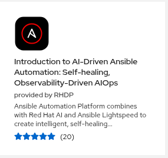

# aiops-workshop-prep

Automates the setup of the [ansible-tmm/aiops-summitlab](https://github.com/ansible-tmm/aiops-summitlab) AIOps workshop so each demo section is ready to run without manual steps.

## Getting Started

**Step 1 — Order the RHDP catalog item:**



> **Introduction to AI-Driven Ansible Automation: Self-healing, Observability-Driven AIOps**
> (provided by RHDP)

**Step 2 — Clone this repo and open it in Claude Code:**

```bash
git clone https://github.com/ericcames/aiops-workshop-prep.git
cd aiops-workshop-prep
claude .
```

**Step 3 — Run setup:**

```
/aiops-setup
```

Claude will ask for your RHDP credentials, create `docs/dev-environment.md`, and run all three phase setup playbooks in sequence.

See [Prerequisites](#prerequisites) for manual setup without Claude Code.

## Upstream Dependency

This repo targets a running instance of the upstream lab. The upstream repo must be deployed to your RHDP environment before running anything here.

| | |
|---|---|
| **Upstream repo** | https://github.com/ansible-tmm/aiops-summitlab |
| **Description** | Summit 2025 AIOps Lab — source of all job templates, rulebooks, and playbooks |

## Workshop Module Map

| Showroom Section | Demo trigger | What happens |
|-----------------|-------------|--------------|
| Part 1: AIOps with Apache Remediation | Run "❌ Break Apache" in AAP | EDA Web App rulebook → AI Insights workflow → Lightspeed remediation → auto-fix |
| Part 2: AIOps with Network Automation | SSH cisco-rtr1, `shut tunnel0` | Syslog → Splunk ospf-neighbor alert → EDA OSPF Neighbor rulebook → Network-AIOps-Workflow |
| Part 3: AIOps with Windows Automation | Launch "Simulate AD Account Creation" or "Simulate Windows Firewall Toggle" | Windows Events EDA rulebook → Mattermost ticket or AI-enriched ticket |

## Prerequisites

- RHDP AIOps workshop environment provisioned (see [RHDP Catalog Item](#rhdp-catalog-item) above)
- Ansible installed locally
- Collections installed (requires Automation Hub token in `~/.ansible/ansible.cfg`):
  ```bash
  ANSIBLE_CONFIG=~/.ansible/ansible.cfg \
    ansible-galaxy collection install -r collections/requirements.yml -p ./collections
  ```
- Credentials populated in `docs/dev-environment.md` (gitignored — never commit):
  ```bash
  cp docs/dev-environment.md.example docs/dev-environment.md
  # edit docs/dev-environment.md with your RHDP instance values
  ```

See [docs/troubleshooting.md](docs/troubleshooting.md) if anything fails.

## Environment Variables

Set these before running any playbook:

```bash
# AAP
export CONTROLLER_HOST=<aap-url>
export CONTROLLER_USERNAME=admin
export CONTROLLER_PASSWORD=<password>

# Splunk (Phase 2)
export SPLUNK_HOST=<splunk-url>
export SPLUNK_USERNAME=admin
export SPLUNK_PASSWORD=<password>

# EDA webhook (Phase 2)
export EDA_WEBHOOK_URL=<eda-webhook-url>

# Bastion SSH — required to reach cisco-rtr1 for Phase 2 reset
export BASTION_HOST=<bastion-host>
export BASTION_PORT=<bastion-port>
export BASTION_USER=lab-user
export BASTION_PASSWORD=<password>
```

## Usage

Each phase corresponds to a section of the workshop. Run setup before the demo, reset between customer sessions.

```bash
# Validate the upstream lab is deployed correctly
ansible-playbook -i inventories/rhdp-<customer>/ playbooks/preflight.yml

# Set up each section
ansible-playbook -i inventories/rhdp-<customer>/ playbooks/setup_phase1_apache.yml
ansible-playbook -i inventories/rhdp-<customer>/ playbooks/setup_phase2_network.yml
ansible-playbook -i inventories/rhdp-<customer>/ playbooks/setup_phase3_windows.yml

# Reset between sessions
ansible-playbook -i inventories/rhdp-<customer>/ playbooks/reset_phase1_apache.yml
ansible-playbook -i inventories/rhdp-<customer>/ playbooks/reset_phase2_network.yml
ansible-playbook -i inventories/rhdp-<customer>/ playbooks/reset_phase3_windows.yml
```

## Inventory Setup

Copy the sample inventory for each new RHDP environment and set the environment variables above:

```bash
cp -r inventories/rhdp-sample/ inventories/rhdp-<customer>/
```

## Phases

| Phase | Showroom Section | Status | What it automates |
|---|---|---|---|
| Phase 1 | Part 1: AIOps with Apache Remediation | ✅ Tested | Builds AI Insights and Remediation workflows |
| Phase 2 | Part 2: AIOps with Network Automation | ✅ Tested | Splunk TCP input, Network Router Setup job, Splunk alert → EDA webhook |
| Phase 3 | Part 3: AIOps with Windows Automation | ✅ Tested | Verifies Windows job templates and EDA activation |

## Claude Code Skills

If you're using [Claude Code](https://claude.ai/code), three slash commands are available that read credentials automatically from `docs/dev-environment.md`:

| Command | What it does |
|---------|-------------|
| `/aiops-preflight` | Validates the environment is ready before a demo |
| `/aiops-setup` | Runs preflight + all three phase setup playbooks in sequence |
| `/aiops-reset` | Resets all three phases to known-good state |

No manual `export` of environment variables needed — each command reads `docs/dev-environment.md` directly.

## License

MIT — see [LICENSE](LICENSE)
